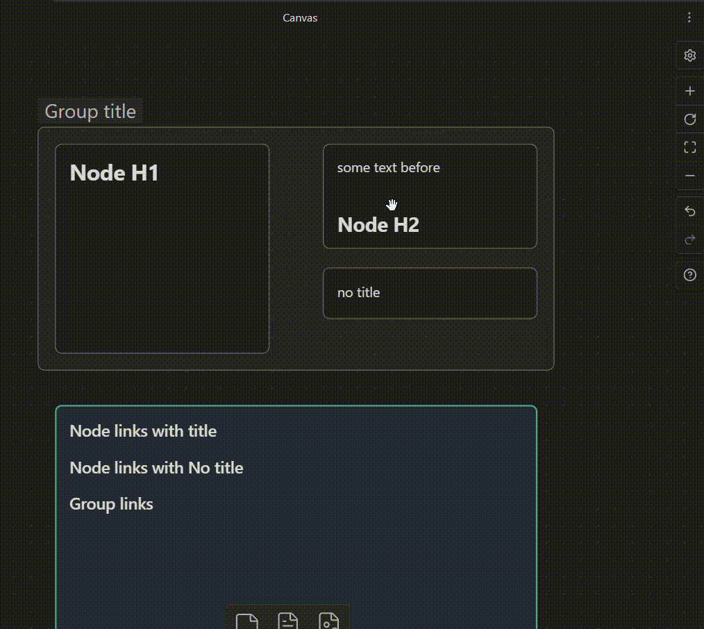
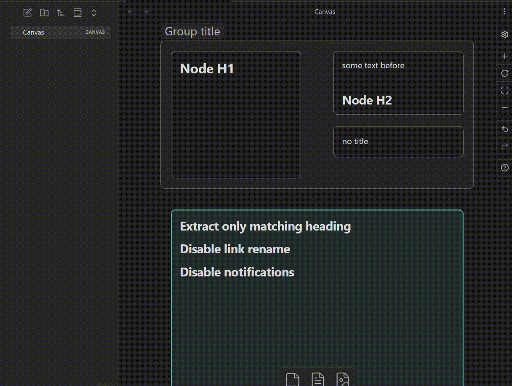

## What it does

**Canvas Node Linker** adds a "Copy Node Link" entry to the right-click menu of any canvas node or group. One click copies a ready-to-paste wikilink to your clipboard:

- **Text nodes** — uses the first heading found in the node's content as display text 
- **Groups** — uses the group label as display text
- **No heading / no label** — copies a bare link with no display text

> if you don't need the node Wikilink option, consider [this plugin](https://github.com/TGRRRR/Canvas-link-to-group)

```
[[my-canvas.canvas#a1b2c3d4|My Heading]]   ← node with heading with label
[[my-canvas.canvas#e5f6g7h8|My Group]]     ← group with label
[[my-canvas.canvas#i9j0k1l2]]              ← node with no heading
```




## Installation

### From the Community Plugin catalog (recommended)

1. Open Obsidian and go to **Settings → Community plugins**
2. Disable **Safe mode** if prompted
3. Select **Browse** and search for `Canvas Node Linker`
4. Select **Install**, then **Enable**

### Manual install

1. Download `main.js` and `manifest.json` from the [latest release](https://github.com/Mvstro/canvas-node-linker/releases/latest)
2. Create the folder `<your-vault>/.obsidian/plugins/canvas-node-linker/`
3. Copy both files into that folder
4. Reload Obsidian and enable the plugin under `Settings → Community plugins`


## Settings
| Setting                   | Description                                                 | Default |
| ------------------------- | ----------------------------------------------------------- | ------- |
| **Include title in link** | Uses the node heading or group label to rename the wikilink | Enabled |
| **Heading level**         | Which heading level to extract as the title (Any, H1–H6)    | Any     |
| **Show notifications**    | Shows a pop-up notice on copy success or error              | Enabled |

*(by "Any" it searches in the Node text and renames the node ID with the first Heading that encounters, if not then it just copies the wikilink with the node ID)*


